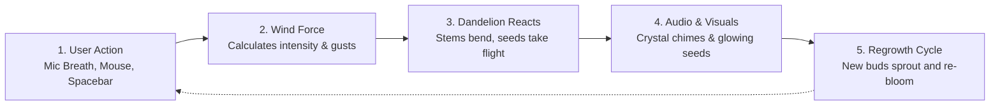

# Lumina Bloom — Simple Workflow

A simple, high-level overview of how **Lumina Bloom** works from user interaction to visual output.

---

## The Workflow at a Glance



---

## How It Works in 4 Steps

### Step 1: User Blows or Interacts
- **Laptop Mic**: Blow gently into the microphone (Web Audio API detects your breath).
- **Mouse / Touch**: Sweep across the screen to create wind gusts.
- **Spacebar**: Tap to simulate blowing instantly.

### Step 2: Wind Force Calculation
- The app measures how hard you blow or move.
- Soft breath dislodges easy outer seeds; hard blowing dislodges stubborn core seeds.

### Step 3: Dandelion Reaction
- **Stem**: Bends dynamically with the wind.
- **Seeds**: Break free, catch the breeze, and swirl upwards into the air with turbulence.
- **Sound**: Plays melodic crystal chimes whenever seeds detach.

### Step 4: Regrowth & Score
- Once a dandelion is swept clean, a celebration chord plays and your score goes up.
- After a short pause, fresh glowing buds sprout from the ground and bloom into new flowers.

---

## How to Run in 3 Steps

1. **Start the Server**:
   ```bash
   python3 -m http.server 8080
   ```
2. **Open in Browser**:
   Go to [http://localhost:8080](http://localhost:8080).
3. **Play**:
   Click **"Laptop Mic"** and blow into your mic, or drag with your mouse!
